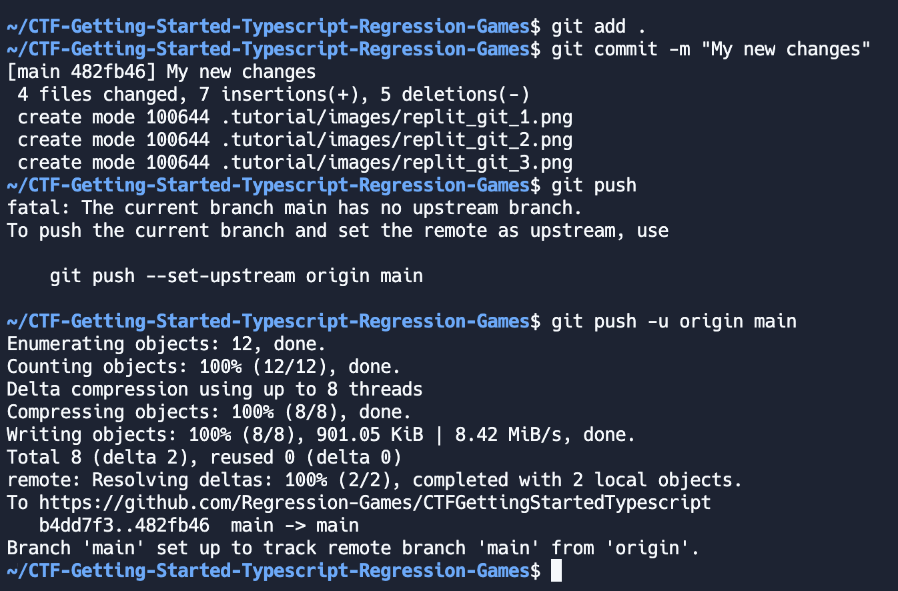
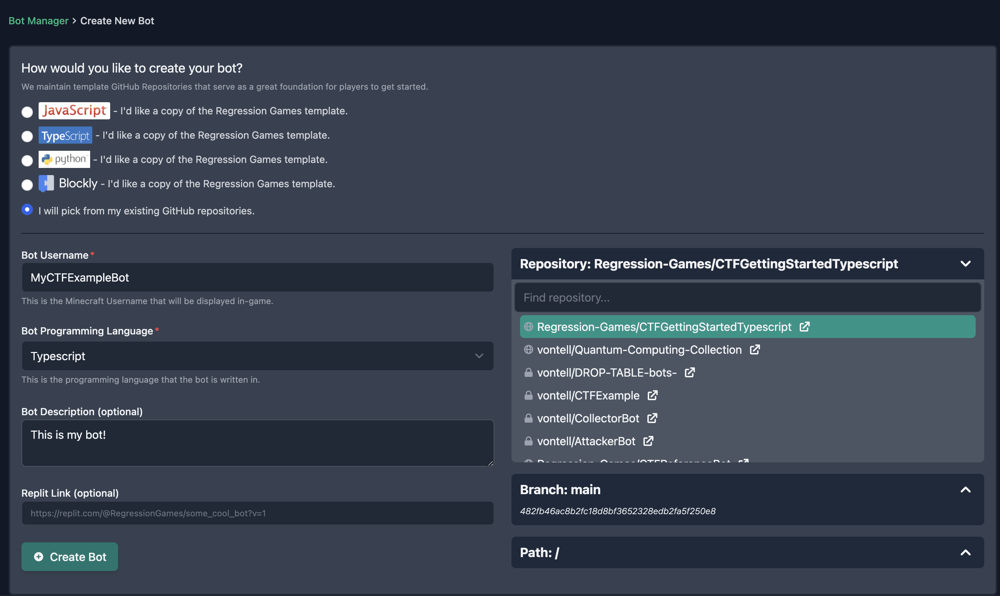
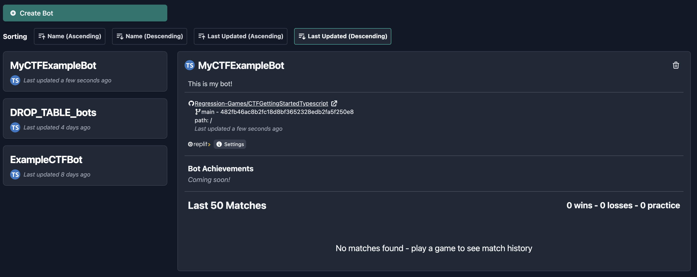
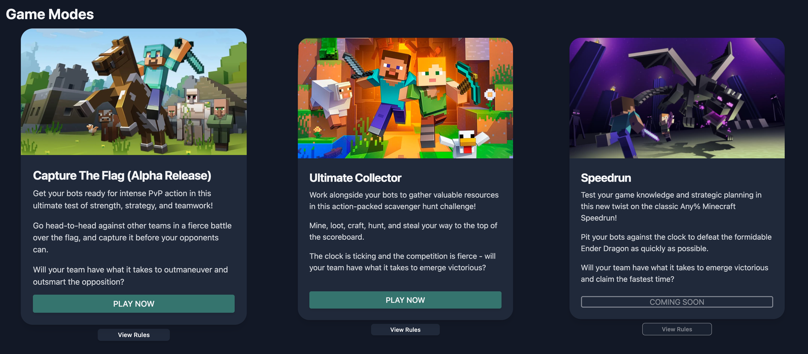
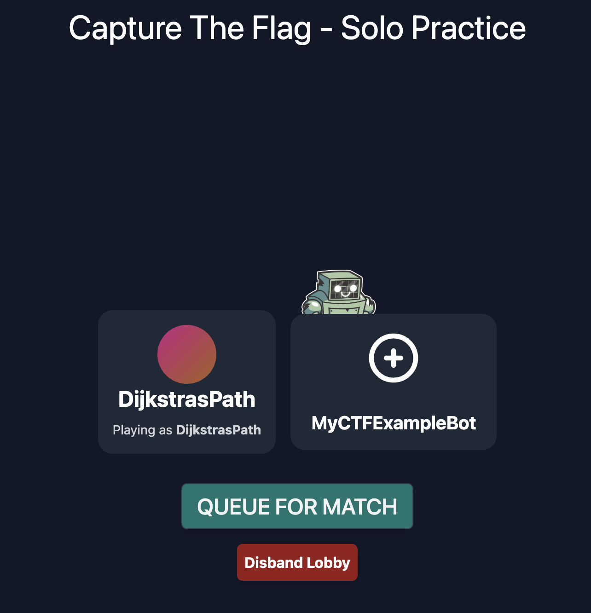
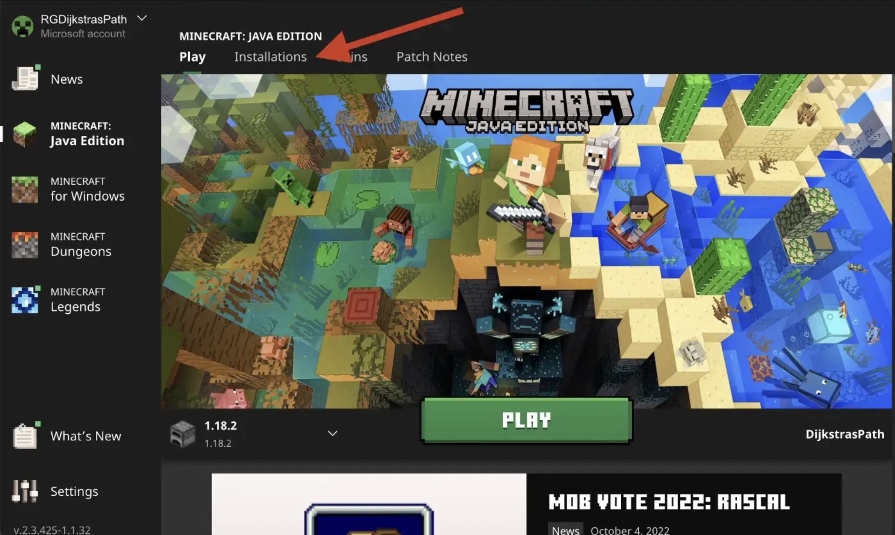
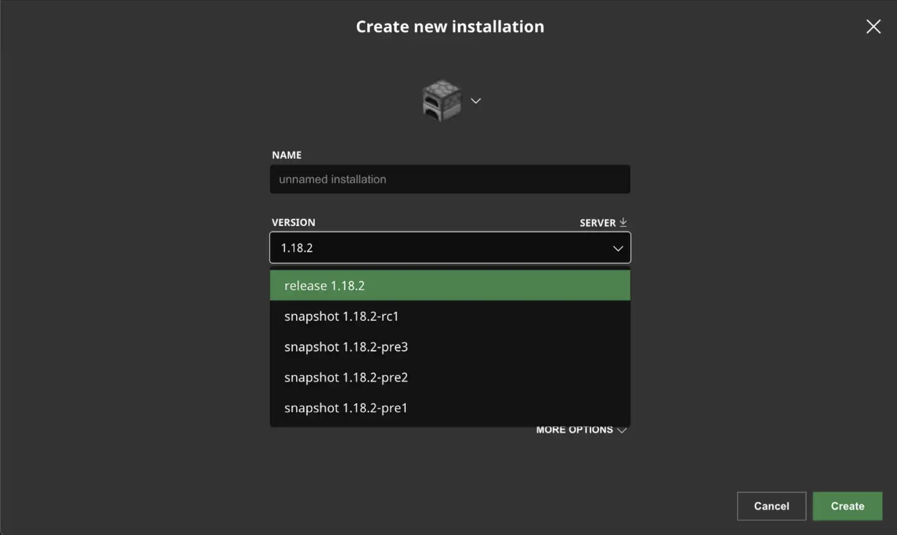
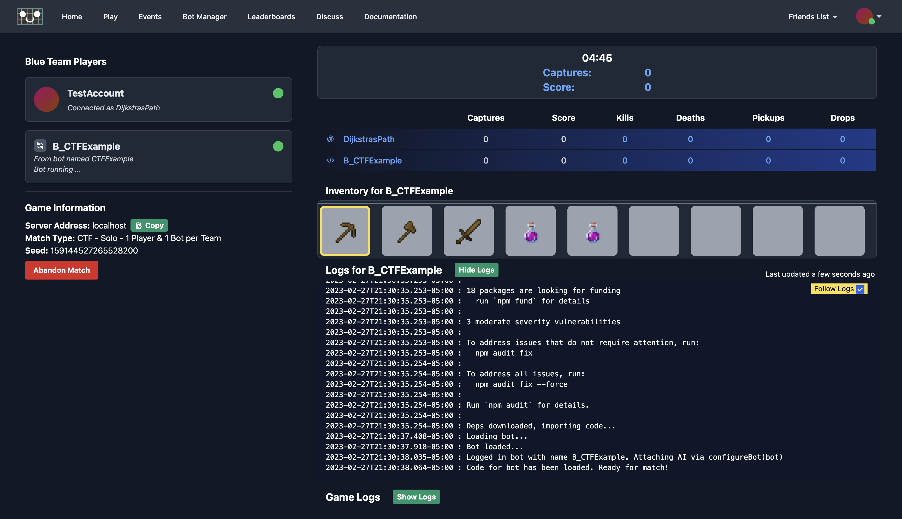

# CTF Turn-Based Bot for Regression Games

_Get started at https://play.regression.gg_

In this repository, we'll show you how to get started with your
first bot on Regression Games! By the end of the tutorial, you will
have a bot that can:

* Heal using potions
* Equip armor
* Attack the flag carrier and other nearby enemies
* Capture the flag and bring it back to base
* Collect items such as potions, weapons, and blocks
* Place blocks on chokepoints to slow the enemy

There are a few ways to get started.

1. **Recommended:** Fork this repository in Replit, and use the Tutorial
   feature to follow along.
2. Complete the tutorial on your own (we have copied all Replit tutorial
   materials into this Readme)
3. Simply clone this repository and start from the completed code.

If you run unto issues or questions, don't hesitate to ask in our 
[Discord](https://discord.com/invite/925SYVse2H)!

---

# Regression Games Capture the Flag - Getting Started <a href="https://play.regression.gg"></a>

Regression Games is an AI + gaming bot platform, and we are pleased to announce our newest game mode and tournament, the Alpha Cup, which features a Capture the Flag game in Minecraft. In this tutorial, we will write a simple bot that reacts to events within the game to capture the flag and score it within your team’s base! Read the section below to learn more about our game mode!

**This is our TypeScript guide. Also see our JavaScript and Python guides!**

**Want to skip the guide and just use the templates? Find those here: Typescript | JavaScript | Python**

**To learn more about our platform in the context of this tutorial, visit [here](https://medium.com/@RGAaron/writing-an-event-based-capture-the-flag-bot-in-minecraft-fdc7c82b766b).

# About the Alpha Cup - $1500+ in prizes!
_Sign up at https://play.regression.gg/events_

[](http://www.youtube.com/watch?v=RgUIYXuewzU "Regression Games Alpha Cup Video")

The Alpha Cup, sponsored by Steamship, is a 3v3 Capture the Flag tournament in Minecraft.
Players program bots in TypeScript, JavaScript, and Python to score points by capturing
flags and killing the opposing team. The first team to 10 flag captures wins! Learn more
about our tournament in our [blog post](https://medium.com/@RGAaron/regression-games-announces-the-alpha-cup-cd1815e7ef9c), as well as read through our [Game Specification](https://regressiongg.notion.site/Capture-the-Flag-Game-Specification-bc72be0f38df427287ec428006d1d299).

# Requirements to get started

* Some knowledge of TypeScript
* A GitHub account (you can create one [here](https://github.com))
* A Minecraft account (Java Edition) with `release 1.18.2` installed from the launcher (download launcher from [here](https://www.minecraft.net/en-us/download), and see [here](https://help.minecraft.net/hc/en-us/articles/360034754852-Change-Game-Version-for-Minecraft-Java-Edition) for changing your version)
* A Regression Games account - create one [here](https://play.regression.gg), and go through the setup flow to connect your GitHub account and Minecraft account.
* Your GitHub account must be connected to Replit - you can do that [here](https://replit.com/account#connected-services).

Let's get started! Click the right arrow below to go to the next page.

> For an example of a completed template see [final_code.ts](#final_code.ts)

> Run into an issue? Send a message in our [Discord](https://discord.gg/925SYVse2H)!

# Create a repo on GitHub

_Message on our [Discord](https://discord.com/invite/925SYVse2H) if you get stuck here!_

The first step to creating a bot on Regression Games is to
create a GitHub repository, which will hold your bot code. 
If you do not have a GitHub account, you can create one 
[here](https://github.com).

Open the "Git" tool on Replit from the tools section (or by clicking
`+` to open a new tab in the editor window and searching for "Git").


In the Git window that appears, click "+ Create a Git repo". Wait a few
seconds, as it sets everything up in your Repl. Eventually, you should
see a "New repo" button appear (or a button to connect your GitHub account
if you haven't yet - do that first). Click that button, enter info about your
new bot (see example below), and then click
"+ Create repository". After a few seconds, your code will be pushed
to GitHub (or click the **Push** button yourself if it is present).
You can now visit your GitHub repository by clicking the
link at the top of the Git tool pane.


## Updating code

Whenever you want to update code for your bot, all you need to do
is push your changes to GitHub! You have two options for doing this (note that
these won't show until you make a change).

1. Visit this Replit Git pane and click "Commit All & Push". Note that sometimes the Git
   pane **will not detect your changes automatically**. If this happens,
   you can close the Git tab and re-open it using the steps above.

2. Open the Shell in Replit, and use normal Git commands. You will be prompted
   to verify usage of your Git credentials from Replit. For example, you can
   use the following series of commands to push new code.

```bash
git add .
git commit -m "A comment about my new changes"
git push # or, for the first time, "git push -u origin main"
```



## Note on ease-of-use (optional)

Coming soon - configs to have the "Run" button in Replit push your code
for you!

# Create your bot on Regression Games

You will now connect your bot to Regression Games.

Visit https://play.regression.gg and log in, or create an account if you
don't already have one (make sure to connect your GitHub account in your [profile](https://play.regression.gg/account)). Once logged in, visit the 
[**Bot Manager**](https://play.regression.gg/bots) page from the navigation
menu.

Click **Create Bot**, and select "No, I will pick from my existing GitHub repositories." Enter a name for your bot, select "TypeScript" as your language, and then select the repository from your GitHub. Select the main branch as well.



Then click **Create Bot**. Once the bot is created, you can find it in your bot list - click it to open up the details about this bot.



Your bot is now ready! Let's move onto the next step, where we will get into a match.

# Join a practice match

Let's code our bot in a practice match! Visit the [game mode
screen](https://play.regression.gg/play) on Regression Games 
by clicking on the "Play" button in
the navigation menu. Select the **Capture the Flag** game
mode, and the **Practice > Solo** mode. In this mode, you and
your bot will be able to play in a match together.



Click **Select a Bot**, select your bot from the list, and
then click **QUEUE FOR MATCH**. Your match will load (please
be patient, the Minecraft server can take a few minutes to
start).



While queuing, let's make sure that Minecraft is ready to go.
Download the Minecraft Java launcher from [here](https://www.minecraft.net/en-us/download),
and then open Minecraft release 1.18.2
(**important: you must use Minecraft release 1.18.2**). If you have not
installed Minecraft 1.18.2, you can do this from the Installations tab in 
the Minecraft launcher.





Once your match loads, you can now connect to the Minecraft server!
The Match Dashboard will provide an IP address for the Minecraft server to
connect to. Click **Copy**, go to Minecraft, select **Multiplayer**,
and then select **Direct Connection**. Paste that address into the
input, and then click Join Server.



Click+hold tab to see the players in the match - eventually you will see your bot
connect (look for its blue outline near spawn).


You will notice that you bot begins to approach the flag, grab the flag, and
then returns to base! Let's take a deeper look at the code and make a few extensions.

# Understanding our algorithm

_Hint - expand this pane to make reading the code a little easier for long lines of code._

In this guide, we are given a starting algorithm for our bot. Open the [index.ts](#index.ts)
file, and let's dig into our algorithm! 

**Please note, you can always skip ahead or see the final code within [final_code.ts](#final_code.ts)**

Before reading the code, let's lay out the overall algorithm. This bot that we have
started with has the following rules:
* On spawn, start what we call the "mainLoop"
* While the bot is alive, perform an action every few milliseconds.
* If we have armor, equip the armor
* Then, do one of the following:
  * Attempt to obtain the flag
  * If the bot has the flag, score it
  * If the flag is not available and the bot does not have it, just wait

You'll notice a few other pieces of the code, such as event handlers and other configuration. You can ignore those for now, and come back to them after the tutorial.
For now, you only need to look at the `mainLoop()` function.

Let's go through each part of our code to see how this works:

### The `bot` and `rgctfUtils` objects

The `bot` object is the main object used to control your bot. This object has
functions and properties for commanding your bot to navigate, attack, pick up
objects, and more. The `rgctfUtils` object has functions and properties that
are helpful specifically for the Capture the Flag game mode, such as finding
the flag and scoring the flag in the correct base.

You can see all of their functions and examples at these links:

* rg-bot: https://play.regression.gg/documentation/rg-bot
* rg-ctf-utils: https://github.com/Regression-Games/rg-ctf-utils

### Starting the bot with `spawn`

Within `index.ts`, you will find an event handler that gets called when our bot
spawns into the world.

```typescript
bot.on('spawn', async () => {
  bot.chat(`I have come to win Capture The Flag with my main loop.`)
  await mainLoop()
})
```

This is the piece of code that starts your bot. Once the bot spawns, it will enter
the main loop, and continue to perform that logic until the bot disconnects
or dies.

### Setting up the mainLoop logic

At the start of the `mainLoop` function, you may notice some strange code:

```typescript
const currentMainLoopInstance = mainLoopInstanceTracker

// make sure our loop exits quickly on death/disconnect/kick/etc
const isActiveFunction = () => { return matchInProgress && currentMainLoopInstance === mainLoopInstanceTracker }
while (isActiveFunction()) {
  try {

    // always throttle the runtime first to make sure we don't execute too frequently and waste CPU
    await throttleRunTime(bot)
    ...
```

What this code does is make sure that when our bot dies, our main loop terminates, so that we don't
have multiple main loops running when a new bot spawns. This is tracked by counting the number
of times we've called this mainLoop function. Next, the while loop itself here is where we
run all of our logic. At the very top, a `throttleRunTime(bot)` call makes sure we wait until the next
game tick to perform an action - this ensures that our bot doesn't perform too many actions in
one turn of the game.

### Getting information about our bot

The next part of our main loop is gathering information about the state
of the game. A bunch of code is written here to:

* Figure out our bot's position using `bot.position()
* Find our opponents using `bot.getOpponentUsernames()` and `bot.findEntities()`
* ... and much more!

These values will be used by our bot to make decisions and perform actions, as you'll see in these next sections.

### Performing our first action - equipping armor

We will now perform our first action - equipping our armor! 

This is as simple as calling the Mineflayer armorManager plugin. Mineflayer is
the underlying library we use to communicate to Minecraft, and you can
learn more about it [here](https://mineflayer.prismarine.js.org/#/).

```typescript
bot.mineflayer().armorManager.equipAll()
```

On every turn, we equip any armor that is in our inventory.

### Handling scoring the flag

The first big action the bot tries to take is attempting to score the flag if the
bot has the flag. We call this function in our mainLoop if we have not done
another action so far (which is tracked via the `didSomething` variable):

```typescript
didSomething = await handleScoringFlag(bot, rgctfUtils, opponents, teamMates)
```

Let's go take a look at this function, located in [lib/MainLoopFunctions.ts](#lib/MainLoopFunctions.ts).

```typescript
export async function handleScoringFlag(bot: RGBot, rgctfUtils: RGCTFUtils, opponents: Entity[], teamMates: Entity[]): Promise<boolean> {
    if(rgctfUtils.hasFlag()) {
        //TODO: Do I need to use potions ? un-equip my shield to run faster ?
        console.log(`I have the flag, running to score`)
        const myTeamName = bot.getMyTeam()
        const myScoreLocation: Vec3 =
            myTeamName == 'BLUE' ? rgctfUtils.BLUE_SCORE_LOCATION : rgctfUtils.RED_SCORE_LOCATION
        await moveTowardPosition(bot, myScoreLocation, 1)
        return true
    }
    return false
}
```

This code does the following:
1. If the bot has the flag (`rgctfUtils.hasFlag()`), then perform the next steps
2. Get the bot's team name
3. Based on the team name, choose the correct scoring location for the flag
4. Move towards that position (see [lib/HelperFunctions.ts](#lib/HelperFunctions.ts)) to see more about this function
5. Return true to indicate that we did perform an action this turn (otherwise we return false)

### Handle capturing the flag

We went over scoring the flag first, as it appears first in our bot's logic - this is because when the bot has the flag, we should prioritize doing that first over everything else.

Now, if the bot does not have a flag to score, the next highest priority is to get the flag! We do this with the following code:

```typescript
if (!didSomething) {
  // go pickup the loose flag
  didSomething = await handleCollectingFlag(bot, rgctfUtils, opponents, teamMates)
}
```

Let's take a look at this code.

```typescript
export async function handleCollectingFlag(bot: RGBot, rgctfUtils: RGCTFUtils, opponents: Entity[], teamMates: Entity[]): Promise<boolean> {
    const flagLocation: Vec3 = rgctfUtils.getFlagLocation()
    if (flagLocation) {
        console.log(`Moving toward the flag at ${bot.vecToString(flagLocation)}`)
        //TODO: Do I need to use potions ? un-equip my shield to run faster ?
        await moveTowardPosition(bot, flagLocation, 1)
        return true
    }
    return false
}
```

Here are the steps of what we are doing in that code.

1. Get the location of the flag, which can be `null` if the flag is nowhere to be found
2. If the flag does exist, move towards that flag
3. Return true if we did perform this action, and false otherwise

### Handle the case where we have nothing to do

Finally, the bot has performed actions to help us score points. If none of those actions
could be performed, let's perform some idle action.

```typescript
if (!didSomething) {
  // we had nothing to do ... move towards the middle
  didSomething = await handleBotIdlePosition(bot, rgctfUtils, opponents, teamMates)
}
```

In this case, our idle action will be to move towards the flag spawn. This will allo
us to control part of the map, and grab the flag when it respawns.

```typescript
export async function handleBotIdlePosition(bot: RGBot, rgctfUtils: RGCTFUtils, opponents: Entity[], teamMates: Entity[]): Promise<boolean> {
    // TODO: Is this really the best place to move my bot towards ?
    // Hint: This is where most of Macro game strategy gets implemented
    // Do my bots spread out to key points looking for items or opponents ?
    // Do my bots group up to control key areas of the map ?
    // Do those areas of the map change dependent on where the flag currently is ?
    console.log(`Moving toward center point: ${bot.vecToString(rgctfUtils.FLAG_SPAWN)}`)
    await moveTowardPosition(bot, rgctfUtils.FLAG_SPAWN, 1)
    return true
}
```

### Next steps

Every tick of the game, our bot will equip armor, and then move to either collect the flag, score the flag, or wait near the flag spawn. Save your code and push it to git,
and your bot will instantly reload! Watch it move around and perform those actions.

Let's move on to making our bot a little more complex and robust, as well as implement some
logic that allows our bot to use more of our utilities.

# Extend our code

Our bot is quite simple right now - repeatedly gets the flag and waits for the flag.
Let's make this ready for a real multiplayer match, by adding logic to:

1. Heal using a potion when at low health
2. Attack the flag carrier if nearby
3. Attack any other opponent that's nearby
4. Place blocks at chokepoints if we have blocks
6. Collect nearby items when waiting for the flag to respawn (see the [Game Specification](https://regressiongg.notion.site/Capture-the-Flag-Game-Specification-bc72be0f38df427287ec428006d1d299) for item info)

**Please note, you can always skip ahead or see the final code within [final_code.ts](#final_code.ts)**

### Add new action calls

First, let's add all of our new functions to our series of priorities in our code.
Underneath the `let didSomething: boolean = false` line of code, copy and paste the
following to replace any existing calls to our bot actions.

```typescript
if (!didSomething) {
  // Check if I'm low on health
  didSomething = await handleLowHealth(bot, rgctfUtils, opponents, teamMates)
}

if (!didSomething) {
  // if someone has the flag, hunt down player with flag if it isn't a team-mate
  didSomething = await handleAttackFlagCarrier(bot, rgctfUtils, opponents, teamMates)
}

if (!didSomething) {
  // do I need to attack a nearby opponent
  didSomething = await handleAttackNearbyOpponent(bot, rgctfUtils, opponents, teamMates)
}

if (!didSomething) {
  // if I have the flag, go score
  didSomething = await handleScoringFlag(bot, rgctfUtils, opponents, teamMates)
}

if (!didSomething) {
  // go pickup the loose flag
  didSomething = await handleCollectingFlag(bot, rgctfUtils, opponents, teamMates)
}

if (!didSomething) {
  // If no-one within N blocks, place blocks
  didSomething = await handlePlacingBlocks(bot, rgctfUtils, opponents, teamMates)
}

if (!didSomething) {
  // see if we can find some items to loot
  didSomething = await handleLootingItems(bot, rgctfUtils, opponents, teamMates)
}

if (!didSomething) {
  // we had nothing to do ... move towards the middle
  didSomething = await handleBotIdlePosition(bot, rgctfUtils, opponents, teamMates)
}
```

### Inspecting the new logic - starting with low health handling

The first piece of new logic we added is handling low health scenarios. Every bot
spawns with a health potion, and we can also pick up various healing and damage
potions as the game progresses.

```typescript
export async function handleLowHealth(bot: RGBot, rgctfUtils: RGCTFUtils, opponents: Entity[], teamMates: Entity[]): Promise<boolean> {
    if (bot.mineflayer().health <= 7) {
        // near death, see if I can use a potion to make the opponent die with me
        const nearOpponent: Entity = opponents.find(them => {
            // within ~4 blocks away
            return them.position.distanceSquared(bot.position()) <= 16
        })
        if (nearOpponent) {
            const potion: Item = getPotionOfType(bot, 'ninja')
            if (potion) {
                // look at their feet before throwing down a ninja potion
                await bot.mineflayer().lookAt(nearOpponent.position.offset(0, -1, 0))
                return await usePotion(bot, potion)
            }
        }
    } else if( bot.mineflayer().health <= 15) {
        // just need a top up
        console.log(`[Health] Need to use potion while my health is low`)
        return await usePotionOfType('health')
    }
    return false
}
```

In this code, the bot:

1. Only apply the following logic if the bot's health is 7 or lower
2. If the bot's health is 7 or lower, and if there is an opponent nearby, throw a
   poison cloud potion (our HelperFunctions file defines these as 'ninja' potions). 
3. Otherwise, if the bot's health is less than or equal to 15, use a healing potion.

This logic allows us to try to kill an enemy if we are almost dead, but heal otherwise.

### Attack a nearby flag carrier

If a nearby enemy has the flag, the bot should prioritize attacking them! We do this
with the `handleAttackFlagCarrier()` helper function.

```typescript
export async function handleAttackFlagCarrier(bot: RGBot, rgctfUtils: RGCTFUtils, opponents: Entity[], teamMates: Entity[]): Promise<boolean> {
    // find out if the flag is available
    const flagLocation: Vec3 = rgctfUtils.getFlagLocation()
    if (!flagLocation) {
        console.log(`Checking ${opponents.length} opponents in range for flag carriers`)
        // see if one of these opponents is holding the flag
        const opponentWithFlag = opponents.filter(them => {
            if (them.heldItem && them.heldItem.name.includes(rgctfUtils.FLAG_SUFFIX)) {
                console.log(`Player ${them.name} is holding the flag`)
                return true
            }
        })?.shift()

        if (opponentWithFlag) {
            console.log(`Attacking flag carrier ${opponentWithFlag.name} at position: ${bot.vecToString(opponentWithFlag.position)}`)
            await usePotionOfType('movement') // run faster to get them
            // TODO: Once I get in range of attack, should I use a combat potion ? should I equip a shield ?
            await bot.attackEntity(opponentWithFlag)
            return true
        }
    }
    return false
}
```

In this code, the bot will:
1. Get the flag location
2. If there is no flag, it looks at nearby opponents, and checks to see if they are
   holding the flag
3. If there is an opponent with the flag, the bot uses a movement potion (if available)
   to go faster, and then attacks that enemy with the `bot.attackEntity()` function.


### Handle any nearby opponent

If there is no bot nearby with the flag, the bot instead focuses on any enemy. 
However, if they are outnumbered, the bot retreats instead.

```typescript
export async function handleAttackNearbyOpponent(bot: RGBot, rgctfUtils: RGCTFUtils, opponents: Entity[], teamMates: Entity[]): Promise<boolean> {
    const outnumbered: boolean = teamMates.length + 1 < opponents.length
    const yolo: boolean = teamMates.length == 0

    const myPosition = bot.position()

    // opportunistically kill any player in close range even if that means dropping the flag to do it
    const theOpponents: Entity[] = opponents.filter(a => {
        // within range 10 regular, 5 if I have the flag
        return a.position.distanceSquared(myPosition) <= (rgctfUtils.hasFlag() ? 25 : 100)
    })

    console.log(`Checking ${theOpponents.length} opponents in range to murder`)
    if (theOpponents.length > 0) {
        const firstOpponent = theOpponents[0]

        //Attack if a teammate is nearby only, otherwise move toward team-mate
        if (!outnumbered || yolo) {
            console.log(`Attacking opponent at position: ${bot.vecToString(firstOpponent.position)}`)
            // TODO: Once I get in range of attack, should I use a combat potion ? should I equip a shield ?
            await bot.attackEntity(firstOpponent)
            return true
        } else {
            console.log(`Outnumbered, running to nearest team-mate for help`)
            //TODO: Do I need to use potions ? un-equip my shield to run faster ?
            await moveTowardPosition(bot, teamMates[0].position, 3)
            return true
        }
    }
    return false
}
```

In this code, the bot is programmed to:

1. Determine if it is outnumbered or by itself.
2. Find nearby enemies. If the bot is carrying the flag, it will still attack, but only
   if the enemy is very close.
3. If the bot is not outnumbered, or if the bot is all alone, go in for an attack.
4. Otherwise, the bot moves toward a teammate

This logic is being smarter than "attack any enemy". Instead, the bot only attacks
if they have no choice, or if they outnumber the opponent. If the bot is near an enemy
and is outnumbered, the bot will go near a teammate for backup!

### Place blocks if any blocks have been collected

As you will see in our next function, the bot may sometimes pick up blocks that it
can place around the map. In the case that we have gravel, dirt, grass, or wood
blocks, let's instruct the bot to blockade parts of the map.

```typescript
export async function handlePlacingBlocks(bot: RGBot, rgctfUtils: RGCTFUtils, opponents: Entity[], teamMates: Entity[]): Promise<boolean> {
    const myPosition = bot.position()
    const myTeamName = bot.getMyTeam()

    const theOpponents = opponents.filter((op) => {
        // only consider bots on the same y plane not those down in the tunnel
        return (Math.abs(op.position.y - myPosition.y) < 5)
    }).filter(a => {
        // only consider opponents within range ~15
        return a.position.distanceSquared(myPosition) <= 225
    })

    console.log(`Checking ${theOpponents.length} opponents in range before getting items or placing blocks`)
    if (theOpponents.length == 0) {

        // If I have blocks to place, go place blocks at strategic locations if they aren't already filled
        const blockInInventory = bot.getAllInventoryItems().find(item => {
            return placeableBlockDisplayNames.includes(item.displayName)
        })

        if (blockInInventory) {
            console.log(`I have a '${blockInInventory.displayName}' block to place`)
            const block_placements = myTeamName == 'BLUE' ? blue_block_placements : red_block_placements
            for (const location of block_placements) {
                // if I'm within 20 blocks of a place to put blocks
                const block = bot.mineflayer().blockAt(location)
                const rangeSq = location.distanceSquared(myPosition)
                console.log(`Checking for block: ${block && block.type} at rangeSq: ${rangeSq}`)
                if (rangeSq <= 400) {
                    if (!block || block.type == 0 /*air*/) {
                        console.log(`Moving to place block '${blockInInventory.displayName}' at: ${location}`)
                        await moveTowardPosition(bot, location, 3)
                        // if I'm close, then place the block
                        if (location.distanceSquared(myPosition) < 15) {
                            console.log(`Placing block '${blockInInventory.displayName}' at: ${location}`)
                            // TODO: RGBot.placeBlock should handle this for us once a defect is fixed
                            await bot.mineflayer().equip(blockInInventory, 'hand')
                            // place block on top face of the block under our target
                            await bot.mineflayer().placeBlock(bot.mineflayer().blockAt(location.offset(0, -1, 0)), new Vec3(0, 1, 0))
                        }
                        return true
                    }
                }
            }
        } else {
            console.log(`No placeable blocks in inventory`)
        }
    }
    return false
}
```

The logic here looks long, but it does the following few steps:

1. Sees how many enemies are nearby, and only does this if no one is nearby
2. Checks to see if it has any blocks in its inventory that it can place
3. If the bot does have placeable block, it tries to find a nearby location where
   it can place a block. These locations that are defined above are parts of the bridge,
   and causes the enemy team bots to walk around the lava pit. It then goes and places
   the block on the face of the desired block (if there is no block already there)

### Loot / collect items that are on the ground

Finally, our last piece of new logic is to collect items that are on the
ground.

```typescript
export async function handleLootingItems(bot: RGBot, rgctfUtils: RGCTFUtils, opponents: Entity[], teamMates: Entity[]): Promise<boolean> {
    const myPosition = bot.position()
    const item: Item = bot.findItemsOnGround({
        maxDistance: 33,
        maxCount: 5,
        // prioritize items I don't have that are the closest
        itemValueFunction: (blockName) => {
            return bot.inventoryContainsItem(blockName) ? 999999 : 1
        },
        sortValueFunction: (distance, pointValue) => {
            return distance * pointValue
        }
    }).filter((theItem: FindResult<Item>) => {
        // @ts-ignore
        // TODO: Should I let my bots run down into the tunnel for better loot ?
        // or keep them on the top only
        return (Math.abs(theItem.result.position.y - myPosition.y) < 5)
    }).map(t => t.result)?.shift()

    if (item) {
        // @ts-ignore
        console.log(`Going to collect item: ${item.name} at: ${bot.vecToString(item.position)}`)
        //TODO: Do I need to use potions ? un-equip my shield to run faster ?

        // @ts-ignore
        await moveTowardPosition(bot, item.position, 1)
        return true
    }
    return false
}
```

This code does the following:

1. Gets the bot's current positition
2. Finds items on the ground using `bot.findItemsOnGround()`. The bot only
   looks up to 33 blocks away, which is their vision range. It assigns a
   low value to blocks that it already has in inventory, and sorts
   the results based on the distance of the block from the bot.
3. The bot then ignores blocks that are not on the same height (i.e. if the
   bot is not in the tunnel, ignore items in the tunnel)
4. Finally, get the item with the best score, and move towards that position.


### Wrapping it all up

Try commiting and pushing this new code using git - your bot will automatically
reload, and you should see it begin to collect items, place blocks, and collect
the flag.
If you get an error, go to your Match Dashboard, click the bot, and click 
"Show Logs" next to your bot name to see what the error might be. At this point,
you can create a disconnect from this practice match, disband your lobby, and
create a new Battle match! Select your bot for all 3 slots of your team, queue
into a match, and see how it compares to other bots! It should now fight the
enemy team as well.

# Next steps

You now have a bot that can collect the flag, collect items, attack, place blocks - what's next?

* **Sign up in the Alpha Cup at https://play.regression.gg/events**
* How can you incorporate [Steamship](https://steamship.com) to give your bot a personality? See their getting started guides [here](https://replit.com/@steamship).
* Read more about the game mode in our [Game Specification](https://regressiongg.notion.site/Capture-the-Flag-Game-Specification-bc72be0f38df427287ec428006d1d299). Learn about
  our point system, important effects, and more!
* Visit our [Discord forum](https://discord.gg/925SYVse2H)
  to talk strategy and get help from players.
* Try out our tools such as our live console and live reloading
  of bots during matches.
* Check out our many [examples and templates](https://github.com/Regression-Games).
* Try different functions that are available in our bot
  frameworks, [rg-bot](https://play.regression.gg/documentation/rg-bot) and
  [rg-ctf-utils](https://github.com/Regression-Games/rg-ctf-utils).

Regarding strategy, here are a few ideas:

* How can you better select items and potions?
* What's the best way to use all three of your bots?
* How can you build a communication system between bots using the `whisper` functionality?
* Should you rush for items, attack enemies, camp their base, or group up?
* What makes for good macro and micro strategy?
* How can you use bow and arrows effectively?
* What are better ways to take control of the center of the map?

_Thank you for trying out Regression Games - more tutorials coming soon!_

